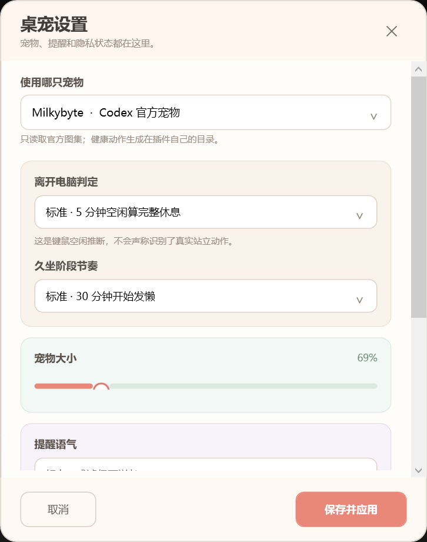
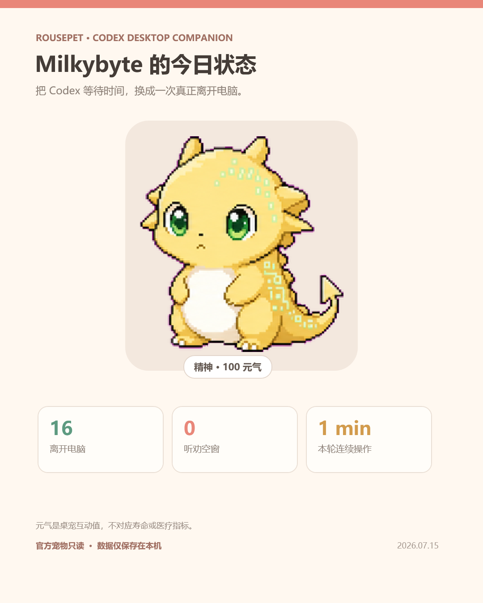

# Codex 宠物健康升级器

把 `/hatch` 生成的 Codex 宠物只读复制到桌面，并加入久坐、离开电脑和 Codex 任务空窗反馈。它是 Codex Plugin + Skill，不安装独立 EXE，也不会修改已有官方宠物。

<p>
  
  
</p>

## 它会做什么

- 只读扫描当前 `CODEX_HOME/pets` 或 `~/.codex/pets`；首次先显示一只，多宠物时自动打开选择器。若一只也没有，Codex 会主动询问一句描述或参考图片，并把生成结果放进插件私有目录后立即显示。
- 在插件私有数据目录生成一份复制体和七组语义动作：精神、发懒、蔫了、病恹恹、休息、庆祝、拖动。宠物缺少某动作时逐级回退到 waiting/idle，不生成不属于它的新表情。
- 默认 0-30 分钟保持精神，30/60/90/120 分钟逐级变化；也可在设置选择早提醒或宽松节奏。最差只是可逆休息，不存在死亡状态。
- 读取系统键鼠空闲秒数。空闲 1-5 分钟逐步恢复；达到 5 分钟后，在用户重新操作键鼠时确认离开电脑并回满，不需要点击“我动过了”。
- Codex 接手任务且用户已经久坐时提醒去活动；此时连续离开键鼠 5 分钟并返回会记录一次“听劝”并播放庆祝。
- 提醒来自本地中文模板，会结合宠物身份、久坐分钟和历史听劝次数变化；可选损友、温柔、冷幽默三种语气，避免连续重复。所有主动提醒合计最多每小时 3 次，任意两次至少间隔 10 分钟。运行期不调用 LLM，也不保存任务正文。
- 单击宠物会庆祝，拖动可移动；悬停后拖右下角或滚轮可在 30%-250% 无级缩放。
- 紧凑右键菜单可换宠物、调整阶段与离开电脑灵敏度、设置安静时段、暂停一小时/当天、运行诊断，并生成 1080×1350 今日分享卡。
- 一句 prompt 或一张参考图也能创建新宠物。生成物写入插件私有 `custom-sources`，不新增或覆盖官方宠物。

## 安装

把仓库链接 `https://github.com/onebluecloud/sit-pet-health` 发给 Codex，并说：

> 安装这个 Codex 宠物健康插件，保持我已有宠物完全不变。

Codex 完成安装后会立即启动一次私有复制体。未来会话第一次触发时，Codex 会显示 Hooks 审核；选择“信任全部并继续”后，它才会随 Codex 自动启动。这个审核是 Codex 的安全边界，插件不会绕过。

高级用户也可以直接运行：

```text
codex plugin marketplace add https://github.com/onebluecloud/sit-pet-health
codex plugin add sit-pet-health@sit-pet-health --json
```

安装命令只登记插件；要在当前任务立刻显示桌宠，安装代理还应执行返回 `installedPath` 下的 `scripts/launch-windows.ps1` 或 `scripts/launch-macos.sh`。Skill 已包含这一步。

### 给 Codex 安装代理

1. 用 `codex plugin marketplace add <当前仓库地址>` 加入 marketplace。
2. 用 `codex plugin add sit-pet-health@sit-pet-health --json` 安装，并读取返回的 `installedPath`。
3. Windows 运行 `PowerShell -ExecutionPolicy Bypass -File <installedPath>\scripts\launch-windows.ps1`；macOS 运行 `/bin/zsh <installedPath>/scripts/launch-macos.sh`。不要要求用户自己找目录或编辑脚本。
4. 告知用户未来会话只需完成一次 Codex Hooks 信任审核。

## 数据边界

| 位置 | 权限 | 内容 |
|---|---|---|
| `CODEX_HOME/pets` 或 `~/.codex/pets` | 只读 | 官方 `pet.json` 与 spritesheet |
| `CLAUDE_PLUGIN_DATA/pets` | 读写 | 私有复制体与健康图集 |
| `CLAUDE_PLUGIN_DATA/health-state.json` | 读写 | 久坐秒数、元气、起身计数 |
| `CLAUDE_PLUGIN_DATA/events` | 读写后即删 | 仅 Hook 事件名与时间，不含 prompt/回复 |
| `CLAUDE_PLUGIN_DATA/share` | 读写 | 用户主动生成的分享卡 |

复制前后会校验官方 `pet.json` 与 spritesheet 的 SHA-256；任何变化都会停止，不会尝试修补源文件。

## 平台状态

- Windows 10/11：正式支持。已完成图集透明度、拖动、单击、无级缩放、系统 idle、Codex Hooks、设置/诊断、分享卡、隐私和源文件不变的端到端验证。
- macOS：实验性支持。使用系统自带 JXA/AppKit/CoreGraphics，不安装 `.app`；当前发布做过语法和协议校验，尚未完成 macOS 真机 UI 验收，设置页与分享卡暂为 Windows 功能。
- Linux：暂不提供桌面浮窗。

## 卸载

对 Codex 说：

> 卸载 Codex 宠物健康升级器，结束桌面窗口并删除它的私有健康数据；保留我的官方宠物。

Skill 会先校验并结束自己的运行进程，再删除插件私有目录，最后执行 `codex plugin remove`。官方宠物目录不在删除范围内。旧 Windows EXE 原型不属于本主版本。

## 许可

项目使用 MIT License。用户自己的 Codex 宠物图像仍归各自用户和创作者所有，本仓库不分发任何用户宠物素材。

## 开发验证

Windows 回归覆盖健康引擎、多 Codex 会话、离开后返回结算、语义动作 fallback、源文件哈希保护、生命周期、设置页和分享卡。跨平台验证定义保存在 `ci/validate.yml`，覆盖 Windows PowerShell 5、Node/JXA 语法与 shell 脚本。
